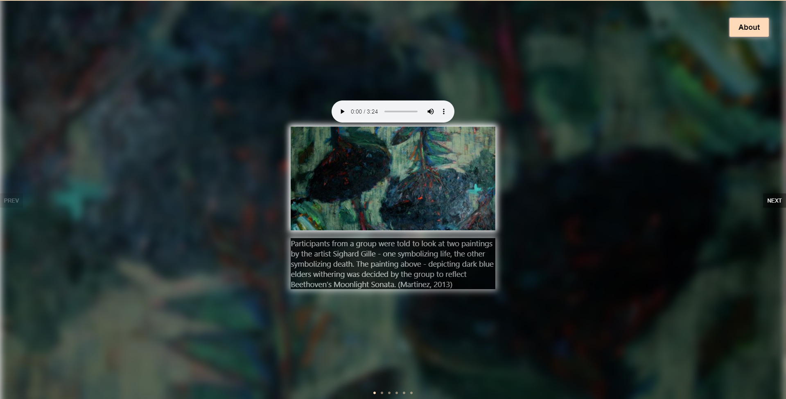
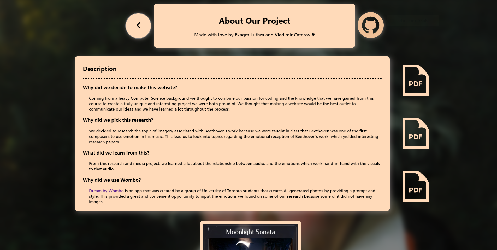

# Beethoven Imagery and Emotion Association
A web app that showcases Beethoven's work and the emotions that others had experienced through his work. 
From these emotions, images were associated to express a deeper level of expression. 

# Instructions
- ## Main Page
  When accessing https://beethoven-imagery.netlify.app/, you are brought to the home screen:
  
  Here we have a slide-show where we had used a library "nuka-carousel" that provides smooth transitioning between slides.
  You may switch between slide by clicking on the screen and dragging in any direction you wish or by clicking "PREV" 
  for the previous image or "NEXT" to navigate to next slide.
  Note: both the first and last slide have limited navigation as we don't allow the user to switch to a slide that does not exist.
  
  The audio player on each slide plays a piece of Beethoven's work that corresponds to the image showcased.
  The user may adjust the volume of the individual player's and play multiple players simultaneously. 
  The user may also adjust playback speed and download the audiofile.
  
  On the top right of the screen is a button that navigates to the about page of our web-app. 
  Clicking that the user will be sent to the about page.
- ## About Page
  When landing on the about page the user is presented with a wide variety of content
  
  We include a header to allow users to navigate back to the main page or to the git repository managed on github.
  In the center of the page, the user is presented with a brief description of our project and resources that we had used for our research.
  Hovering over these "pdf" images, the user can see a tooltip listing the name of the file it will link to.
  
  Scrolling further, the user is presented another slideshow that showcases some great AI-generated photos of beethoven and associated phrases.
  
  Slideshow navigation is identical to that of the main page.
  
# Demo

# Collabortors
Ekagra Luthra: https://github.com/ekluthra

# External Libraries Used:
* `react` and its dependencies
* `react-router-dom`
* `nuka-carousel`

# Additional Notes:
* icons used from https://iconmonstr.com/
* please navigate the resource links to some images we had sourced
some images sourced and created from https://app.wombo.art/
